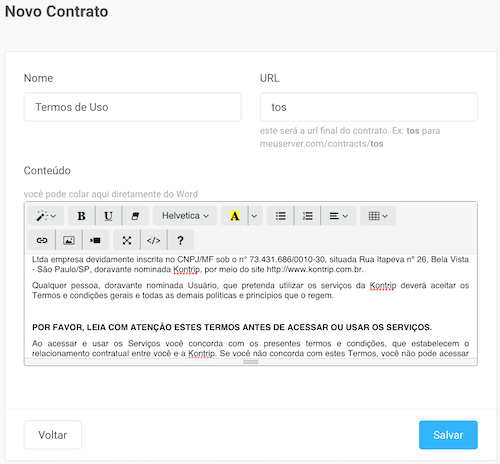

# DevmakerContracts
Rails Engine to add a private contracts CRUD and a public display of each contract.

Specially usefull for projects that have a custom **Terms of Service** and **Privacy Policies** contracts displayed in a webview inside the mobile apps

## Usage
### Install:
1. Add this line to your application's Gemfile:
    ```ruby
    gem "devmaker_contracts", git: "https://gitlab.com/devmaker-mobile-apps/rails/devmaker_contracts.git"
    ```
1. And then execute:
    ```bash
    $ bundle
    ```

1. :warning: This is a private gem, so you need to have your local `bundler` configured with your GitLab credentials:
    ```bash
    $ bundle config gitlab.com YourGitLabUsername:YOUR_GITLAB_PASSWORD
    ```
1. :warning: Do not add your GitLab credentials at the deploy server. Use the `@devmaker-ci-cd` GitLab user instead! Heroku Example:
    ```bash
    $ heroku config:set BUNDLE_GITLAB__COM=devmaker-ci-cd:THE_SUPER_SECRET_PASSWORD
    ```

### Configure:
1. Create a `config/initializers/devmaker_contracts.rb` config file with:
    ```ruby
      # Controll the access to edit contracts. Should be the controller that restrict access.
      DevmakerContracts.private_controller =  "AdminController"

      # The public controller used to only display the contracts (defaults to ApplicationController)
      DevmakerContracts.public_controller =  "PublicController"
    ```

1. Mount the engine in your `config/routes.rb`:
    ```ruby
    mount DevmakerContracts::Engine => "/contracts", as: :contracts
    ```

1. Copy and run the migrations:
    ```bash
    bin/rails devmaker_contracts:install:migrations
    bin/rails db:migrate
    ```

### Use:

>:warning: The Engine pages will share the same `private_controller` template (with menu and headers) from your app. So you need to make sure every **Rails route variable** shared from your app to this engine is prefixed with `main_app.your_route_path`.
In practice, you need to change partials like `menu.html.rb` and `header.html.rb` to replace variables from `dashboard_path` to `main_app.dashboard_path`.


1. Point this gem path in your menu:
    ```erb
    <li class="sidenav-item<%= current_page?(main_app.contracts_path) ? ' active' : '' %>">
      <%= link_to main_app.contracts_path, class: "sidenav-link" do %>
        <i class="sidenav-icon fas fa-file-contract"></i>
        <div>Contratos</div>
      <% end %>
    </li>
    ```

1. DONE! You have new a private CRUD of contracts. You can create a new contract, assign a URL and paste the content directly from WORD:
    


1. [Example commit](https://gitlab.com/devmaker-mobile-apps/rails/cartax/commit/74d8c921c809368323a7c83177195eb96d956ac0)
